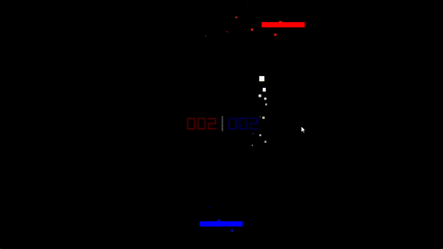

# odin-pong

First time using the odin programming language, so I decided to make a pong game in it.

## running

dowbnload the latest release and run it.

## controls

A, D keys- red movement \
<=, => arrow keys - blue movement \
P - pauses the game \
R - resets the game after someone wins \

## building

make sure you have the odin compiler installed (https://odin-lang.org/docs/install/)
just run buildrun.bat to build and run

